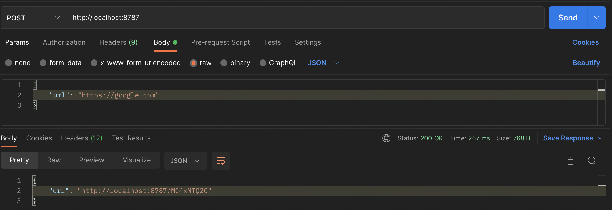

## Introduction

You want to shorten the long links generated by your application because the URLs are too long to fit in an SMS. You
want to keep scalability in mind and want to handle millions of shortened URLs and millions of users flowing through
the links. Most importantly, you want this new service to be as cheap as possible - it can't break the bank.

In this article, we will use Cloudflare Workers and KV to create a scalable URL shortener service that you can use
to shorten your application links.

## The Stack

[Cloudflare Workers](https://workers.cloudflare.com/) is a Serverless platform that allows you to deploy code and
have it available globally with extremely low latency. Cloudflare Workers...

- is much cheaper than competitors such as Azure Functions and AWS Lambda. ($5/10 million requests)
- can run code instantly without suffering from cold starts like the competitors.
- can automatically scale to millions of users - you are only charged per request and not the number of concurrent users.

<br/>

The reason why Cloudflare can do this is that it doesn't rely on the traditional serverless model of using the
virtual machine architecture. Instead, it utilizes the Chrome V8 engine with the Service Workers API to run code
extremely fast. If you are a nerd like me - [reading this](https://blog.cloudflare.com/introducing-cloudflare-workers/) will amaze you.

Alternatively, you would probably write a simple Express or Flask app, dockerize it, and deploy it through
`docker-compose` or Kubernetes.

[Workers KV](https://developers.cloudflare.com/workers/learning/how-kv-works) is a key-value store that is globally
distributed. We're going to use it to map from a short link to the original long URL.

A URL shortener service is one of the best case to utilize serverless functions. It does 1 simple job, so you shouldn't
waste your time into thinking about infrastructure, and most importantly, an expensive bill to pay at the end of month.

Alternatively, this might be a mix of a PostgreSQL server for permanent storage and Redis to cache results.

## The Preparation

1. Sign up for a [Cloudflare Account](https://dash.cloudflare.com/sign-up).
2. Install Cloudflare's CLI tool, [Wrangler](https://developers.cloudflare.com/workers/wrangler/get-started/).

```bash
npm install wrangler --save-dev
```

3. Authenticate yourself with Wrangler by following instructions on screen to complete OAuth with Cloudflare.

```bash
npx wrangler login
```

## The Plan

We want to expose 2 endpoints for the user - one to create a shortened URL, and the other to serve all shortened
URLs, perform 302 redirects if the shortened link is found, and 404 otherwise.

## The code

### Step 1: Generate a boilerplate for Cloudflare Workers

In a local directory, run `npx wrangler init shortener`. It's going to create the necessary files and folder structure
for you to create our URL shortener. You will be prompted to select a few options, which you will select yes to.

- Would you like to use git to manage this Worker? `y`
- No package.json found. Would you like to create one? `y`
- Would you like to use TypeScript? `y`
- Would you like to create a Worker at shortener/src/index.ts? `Fetch Handler`

To further simplify development, since we are going to make more than 1 endpoint, we'll
install [itty-router](https://github.com/kwhitley/itty-router) which is an Express like router to automatically parse
out the HTTP method, query params, path params, etc. I also prefer to use [prettier](https://prettier.io) to format
the code so that it looks consistent.

```bash
cd shortener
rm package-lock.json
yarn
yarn add itty-router
yarn add --dev prettier
```

<br/>

### Step 2: Create a KV namespace

KV is basically the replacement for the database and cache you were going to use to make your Express URL shortener.
The difference being, KV is as easy to use as the browser's localStorage. To create a KV namespace on your Cloudflare
account, run the following commands. We'll need to run both because we'll need to reserve one for development as well.

```bash
npx wrangler kv:namespace create SHORTENER_KV
npx wrangler kv:namespace create SHORTENER_KV --preview
```

Note down the KV ids and edit `wrangler.toml` to look like the following. When you deploy with Wrangler, it will set
the correct variables and link the KV namespace to your worker.

```toml title=wrangler.toml
name = "shortener"
main = "src/index.ts"
compatibility_date = "2022-08-11"

kv_namespaces = [
  {
    binding = "SHORTENER_KV",
    id = "<Your KV ID>",
    preview_id = "<Your KV preview ID for development>"
  }
]

[vars]
HOST_URL = "http://localhost:8787"

```

<br/>

### Step 3: Make the API to shorten a URL

I like to write out the skeleton of what I'm going to implement before actually implementing the logic behind it, as
I feel like it will lead to better code structure. In the below snippet, I am creating an `itty-router` that will
triage API requests to the POST and GET functions respectively. Also, I am linking the KV namespace in the environment.
Finally, from my experience, it is ideal to add console.log statements here and there to help with debugging in case
my Worker goes wrong.

```typescript title=src/index.ts
import { Router } from "itty-router";
const router = Router();

export interface Env {
  SHORTENER_NAMESPACE: KVNamespace; // the KV namespace we setup in the previous step
  HOST_URL: string;
}

router.post("/", async (request: Request, env: Env) => {
  // TODO: Post request to shorten a URL
});

router.get("/:slug", async (request: Request, env: Env) => {
  // TODO: redirect shortened URL to application URL
});

export default {
  async fetch(
    request: Request,
    env: Env,
    ctx: ExecutionContext
  ): Promise<Response> {
    return router.handle(request, env, ctx).then((res: Response) => {
      console.log("HTTP Response", request.url, res.status);
      return res;
    });
  },
};
```

Now, we can fill in the logic to create a shortened URL. In the below code snippet, I am generating a random slug that
has not been used before, and using that as the key to store the long URL that the user has passed in. Finally, I am
returning the user a shortened URL that they may use to redirect to their URL.

```typescript
router.post("/", async (request: Request, env: Env) => {
  const json = await request.json();
  const longLink = json?.url;
  // generate a random slug - this is not cryptographically random but works in our case
  let slug = btoa(Math.random() + "").slice(0, 9);
  // generate a new slug if the previous one is already existing
  let existing = await env.SHORTENER_KV.get(slug);
  while (existing) {
    slug = btoa(Math.random() + "").slice(0, 9);
    existing = await env.SHORTENER_KV.get(slug);
  }
  // generate shortened URL and return to user
  await env.SHORTENER_KV.put(slug, longLink);
  return new Response(JSON.stringify({ url: `${env.HOST_URL}/${slug}` }), {
    headers: { "content-type": "application/json" },
  });
});
```

At this point, we should test our code. To run a dev server, run `npm run start`. Then, you can use Postman to
test out the server for now.



<br/>

### Step 4: Handle the URL redirect

When the user visits the shortened URL, we would like to fetch the long URL from KV, and provide the user with a
302 redirect response, so that the browser can handle the redirection for us. If the shortened slug cannot be found,
we can return a 404 telling them nothing is here.

```typescript
router.get("/:slug", async (request: Request, env: Env) => {
  const slug = request.params.slug;
  const redirectTo = await env.SHORTENER_KV.get(slug);
  if (redirectTo) {
    return Response.redirect(redirectTo, 302);
  }
  return new Response("URL not found", {
    status: 404,
  });
});
```

Hopefully by now, 8 minutes in, you have a fully working URL shortener that is deployed locally. We'll leave the last
2 minutes for deployment, which is more than enough.

## The deployment

Simply run `npm run deploy` and Wrangler will handle the rest. By default, Cloudflare Workers will provision you a
`workers.dev` subdomain but you can also configure your own by going into the Cloudflare Dashboard under Workers.

```
- KV Namespaces:
  - SHORTENER_KV: <your KV ID>
- Vars:
  - HOST_URL: "http://localhost:8787"

Published shortener (3.83 sec)
  https://shortener.cho.workers.dev
```

As you can see, the `HOST_URL` used is still the one we defined at the beginning, using localhost:8787. Remember to
change the URL to the published URL, in my case, `https://shortener.cho.workers.dev`. (Feel free to check this out!)

After you modify `wrangler.toml`, run `npm run deploy` again.

## Debugging with Workers
One of the hardest thing of programming something in a new language or system is debugging. Although `wrangler dev` can
bring you very far into the debugging journey, sometimes, you will encounter issues only visible after deploying to
Cloudflare. Luckily, Cloudflare provides a way to tail production logs - as long as you write `console.log` in your
worker code for debugging purposes. After that, you can tail the logs using wrangler.

```bash
npx wrangler tail --format=pretty
```

## Go further

This example is meant to showcase the power of a serverless URL shortener. Here are a couple enhancements I would make
to the code, and I will leave it as an exercise
to the reader:

- Input validation for POST request
- Authenticate via Bearer/Basic token
- Return a fancy UI if the link is not found.
- ... (let's not limit creativity here)

## Source Code

With ~50 lines we were able to completely recreate a URL shortener. You can checkout all the code used in this tutorial
[here](https://github.com/choyiny/shortener).

That's 10 minutes of your life writing (maybe) your first Worker and also (maybe) your first URL shortener. Hope you
enjoyed this!
