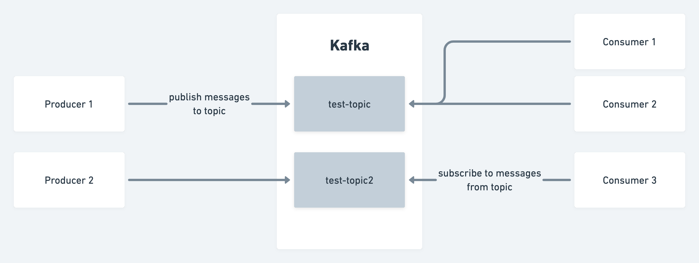
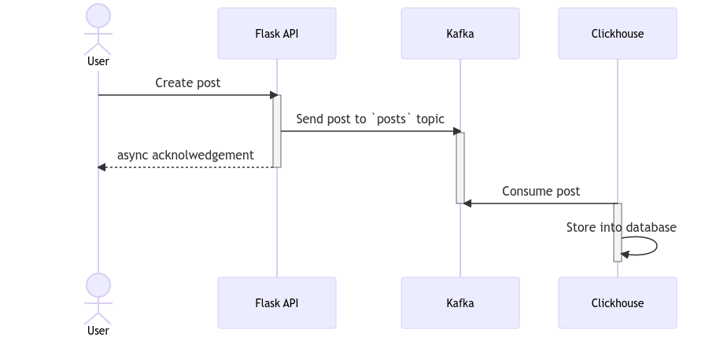

## Introduction

[Kafka](https://kafka.apache.org/) is a streaming platform that is used to process data in real-time. In a world where
data is king, Kafka is a valuable tool for developers and data engineers to learn. However, setting up Kafka locally can be
frustrating, which can discourage learning. In this article, I will show you the fastest way to set up Kafka for development
using Docker, and also show you how this setup can support connecting locally and from other local Docker containers.

This tutorial assumes that you have some knowledge of using Docker and `docker-compose` for development. If you are new to
Docker, I recommend reading [this article](https://docs.docker.com/get-started/overview/) first. If you need to install
Docker, follow the instructions [here](https://docs.docker.com/get-docker/).

## Kafka Overview

The below diagram shows a high level overview of what Kafka is for beginners. (there's lot more to Kafka, like Zookeeper, Consumer
Groups, Partitions, etc. but we'll leave that for another time.)



Kafka categorizes data into topics. A topic is a category or feed name to which records are published.

Producers publish messages to a specific topic. The messages can be in any format, with JSON and Avro being popular options. For example, a social media platform might use a producer to publish messages to a topic called posts whenever a user creates a post.

Consumers subscribe to a topic to consume the records published by producers. In the social media example, there might be a consumer set up to consume the posts topic to perform safety checks on the post before it is published to the global feed, and another consumer may asynchronously send notifications to the user's followers.

## Setting up Kafka on Docker

We will make use of the bitnami images for Kafka and Zookeeper. I prefer this over the wurstmeister images because it is
easier to setup and more actively maintained. We will also make use of
the [docker-compose](https://docs.docker.com/compose/) tool to manage our containers.

Create a file called `docker-compose.yml` and add the following content:

```yml
# docker-compose.yml
version: "3.7"
services:
  zookeeper:
    restart: always
    image: docker.io/bitnami/zookeeper:3.8
    ports:
      - "2181:2181"
    volumes:
      - "zookeeper-volume:/bitnami"
    environment:
      - ALLOW_ANONYMOUS_LOGIN=yes
  kafka:
    restart: always
    image: docker.io/bitnami/kafka:3.3
    ports:
      - "9093:9093"
    volumes:
      - "kafka-volume:/bitnami"
    environment:
      - KAFKA_BROKER_ID=1
      - KAFKA_CFG_ZOOKEEPER_CONNECT=zookeeper:2181
      - ALLOW_PLAINTEXT_LISTENER=yes
      - KAFKA_CFG_LISTENER_SECURITY_PROTOCOL_MAP=CLIENT:PLAINTEXT,EXTERNAL:PLAINTEXT
      - KAFKA_CFG_LISTENERS=CLIENT://:9092,EXTERNAL://:9093
      - KAFKA_CFG_ADVERTISED_LISTENERS=CLIENT://kafka:9092,EXTERNAL://localhost:9093
      - KAFKA_CFG_INTER_BROKER_LISTENER_NAME=CLIENT
    depends_on:
      - zookeeper
volumes:
  kafka-volume:
  zookeeper-volume:
```

Notice that we set a few environment variables for the Kafka container. For more information, see the [bitnami/kafka](https://hub.docker.com/r/bitnami/kafka) image documentation. See that we have also defined a `zookeeper` service. This is because Kafka depends on Zookeeper to store metadata about the topics and partitions. For development purposes, you don't need to interact with it and
you can safely ignore it for the time being.

To run this, simply run `docker-compose up -d` and you should see the following output:

```bash
$ docker-compose up -d
Creating network "kafka-on-docker_default" with the default driver
Creating volume "kafka-on-docker_kafka-volume" with default driver
Creating volume "kafka-on-docker_zookeeper-volume" with default driver
Creating kafka-on-docker_zookeeper_1 ... done
Creating kafka-on-docker_kafka_1     ... done
```

## Interacting with the Kafka container from your local machine

kafkacat offers a simple command line interface to interact with Kafka. It is a great tool to use to sanity check that Kafka is running. To install kafkacat, follow instructions from https://github.com/edenhill/kcat depending on your operating system.

To sanity check that Kafka is running, run the following command to list all topics currently in Kafka:

```bash
$ kcat -b localhost:9093 -L  # list all topics currently in kafka
Metadata for all topics (from broker 1: localhost:9093/1):
 1 brokers:
  broker 1 at localhost:9093 (controller)
 0 topics:
```

Note that we are using `localhost:9093` instead of the default 9092 port. This is because we are using the port that is exposed to our local machine.

To test out the producer, run the following command:

```bash
$ kcat -b localhost:9093 -t test-topic -P  # producer
one line per message
another line

```

The default delimiter between messages is a newline. When you are done, press `ctrl-d` to send the messages.
(FYI - clicking `ctrl+c` will not work, you will have to try again.)

To read the messages you have produced, run the following command to start a consumer:

```bash
$ kcat -b localhost:9093 -t test-topic -C  # consumer
one line per message
another line
% Reached end of topic test-topic [0] at offset 2
```

Publishing arbitrary text is not quite what we want though, so let's try publishing JSON messages instead. To make this easier
for extension, we will write some Python scripts to produce and consume messages.

To start, you must install the `kafka-python` library. You can do this by running `pip install kafka-python`, or if you are
more advanced, use a `virtualenv` and install from `requirements.txt` instead.

```python
# producer.py
from kafka import KafkaProducer
from datetime import datetime
import json
producer = KafkaProducer(
    bootstrap_servers=['localhost:9093'],
    value_serializer=lambda v: json.dumps(v).encode('utf-8')
)
producer.send('posts', {'author': 'choyiny', 'content': 'Kafka is cool!', 'created_at': datetime.now().isoformat()})
```

Below is an example of a Python consumer that subscribes to `post` and prints out every value.

```python
# consumer.py
from kafka import KafkaConsumer
import json
consumer = KafkaConsumer(
    'posts',
    bootstrap_servers=['localhost:9093'],
    value_deserializer=lambda m: json.loads(m.decode('utf-8'))
)
# note that this for loop will block forever to wait for the next message
for message in consumer:
    print(message.value)
```

## Connecting to Kafka from another Docker container

If you produce messages to a Kafka topic, you most likely have planned a destination for the messages. For example, the above
snippet shows how you can write your own python consumer. Sometimes though, you would want to transport your messages to another
database such as Clickhouse or Elasticsearch for further processing or visualizations.

Although you can insert messages directly into Clickhouse, for a more scalable solution, you can make use of bulk insertions to
minimize transactions. (Again, this is a topic for another time... our goal really is to get a POC up and running.)

Let's show an example integration of our Dockerized Kafka to Clickhouse, an OLAP database. (What
Clickhouse is will be an article for another time...)

To learn more about Clickhouse's table engine, see [Using the Kafka table engine](https://clickhouse.com/docs/en/integrations/kafka/kafka-table-engine).

Create a file called `docker-compose.yml` and add the following content:

```yml
# docker-compose.yml
version: "3.7"
services:
  clickhouse:
    restart: always
    image: clickhouse/clickhouse-server
    ports:
      - "8123:8123"
      - "9000:9000"
    volumes:
      - "clickhouse-volume:/var/lib/clickhouse/"
volumes:
  clickhouse-volume:
```

Now we are ready to connect to Clickhouse. Run the following command to start the Clickhouse container:

```bash
$ docker-compose -f clickhouse.docker-compose.yml exec clickhouse clickhouse-client
ClickHouse client version 22.11.2.30 (official build).
Connecting to localhost:9000 as user default.
Connected to ClickHouse server version 22.11.2 revision 54460.

Warnings:
 * Linux is not using a fast clock source. Performance can be degraded. Check /sys/devices/system/clocksource/clocksource0/current_clocksource

0cd6f3269407 :)
```

This is an interactive shell that allows you to run SQL commands. To create a table, run the following command:

```sql
-- create messages queue
CREATE TABLE default.message_queue
(
  created_at DateTime,
  content String,
  author String
)
ENGINE = Kafka(
  'kafka:9092',
  'posts',
  'clickhouse',
  'JSONEachRow'
) settings kafka_thread_per_consumer = 1, kafka_num_consumers = 1;
```

Note how we are using `kafka:9092` as the connection string instead of `localhost:9093` when connecting to Kafka locally. This
is because we are connecting to it through the internal Docker network.

Let's create a few more tables to visualize the data:

```sql
-- create messages table
CREATE TABLE default.messages
(
  created_at DateTime,
  content String,
  author String
)
ENGINE = MergeTree
ORDER BY created_at;

-- create materialized view
CREATE MATERIALIZED VIEW default.messages_mv
TO default.messages
AS SELECT * FROM default.message_queue;
```

I'll leave it as an exercise to the reader to come up with the SQL queries to select the data in the `messages` table.

## Linking it all together

For our demo app, we will create an API endpoint `POST /posts` in Python Flask, and instead of saving it to a database directly,
we are going to produce it to the Kafka topic `posts`. Follow along below or by cloning
[this demo repo](https://github.com/choyiny/kafka-on-docker-development). On top of that, since we have setup Clickhouse
to consume messages from Kafka, we will be able to see the messages in the Clickhouse UI.



Here's the straight forward code for the API endpoint:

```python
# app.py
# fun fact: This snippet was generated entirely by Copilot
from flask import Flask, request
from kafka import KafkaProducer
from datetime import datetime
import json

app = Flask(__name__)
producer = KafkaProducer(
    bootstrap_servers=['kafka:9093'],
    value_serializer=lambda v: json.dumps(v).encode('utf-8')
)

@app.route('/posts', methods=['POST'])
def create_post():
    post = request.get_json()
    # clickhouse can only parse strings without milliseconds
    post['created_at'] = datetime.now().strftime("%Y-%m-%dT%H:%M:%S")
    producer.send('posts', post)
    return 'ok'
```

To run this, you can use the following command:

```bash
$ flask run
```

After running, you can try out the endpoint by executing a curl command:

```bash
$ curl -X POST -H "Content-Type: application/json" -d '{"author": "choyiny", "content": "Kafka is cool!"}' http://localhost:5000/posts
```

It would be cool if it worked first try, however, these are commands you can use to pull out the logs from Clickhouse to inspect
errors:

```bash
$ docker-compose exec clickhouse tail -f /var/log/clickhouse-server/clickhouse-server.log
```

To remove corrupted messages from a kafka topic, it is sufficient to just delete the topic entirely with this command:

```bash
$ docker-compose exec kafka /opt/bitnami/kafka/bin/kafka-topics.sh --bootstrap-server localhost:9092 --delete --topic posts
```

Ideally, there are no errors. I'll leave it as an exercise to the reader to connect to Clickhouse again and inspect that data
from Kafka is being consumed.

And there you have it! An end to end solution with Kafka on Docker in a local environment. Again, all the code is available
at [this demo repo](https://github.com/choyiny/kafka-on-docker-development). If you have any questions, feel free to drop a
comment below!
